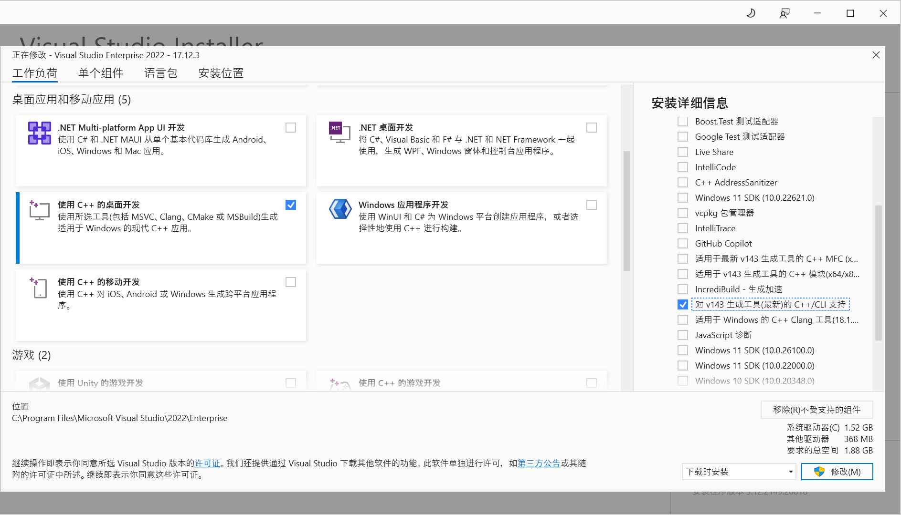

## 镜像源配置

conda 镜像源配置参考此文章
https://blog.csdn.net/SUNYUAN0627/article/details/130181974
pip 镜像源配置参考此文章
https://blog.csdn.net/weixin_57950978/article/details/142653359

```sh
# 配置镜像源
## conda镜像源
conda config --add channels https://mirrors.tuna.tsinghua.edu.cn/anaconda/pkgs/free/
conda config --add channels https://mirrors.tuna.tsinghua.edu.cn/anaconda/pkgs/main/
conda config --add channels https://mirrors.tuna.tsinghua.edu.cn/anaconda/cloud/conda-forge/
## pip镜像源
pip config set global.index-url https://pypi.tuna.tsinghua.edu.cn/simple
## pip镜像源配置文件位置
C:\Users\jxwang\AppData\Roaming\pip\pip.ini
# 设置搜索时显示通道地址
conda config --set show_channel_urls yes
```

## 环境搭建

```sh
# 创建虚拟环境
conda create -n BasicSR python=3.6
```

- 遇到问题
  `AttributeError: module 'lib' has no attribute 'X509_V_FLAG_CB_ISSUER_CHECK'`
- 解决方案

```sh
pip uninstall pyOpenSSL
pip install pyOpenSSL
pip install pyOpenSSL --upgrade --可选
```

```sh
# 继续创建虚拟环境
conda create -n BasicSR python=3.6
# 切换虚拟环境
conda activate BasicSR
# 进入项目路径
cd C:/Users/jxwang/Desktop/superresolution/BasicSR-master
# 安装 requirements.txt
pip install -r requirements.txt
```

- 报错`Exception: Building py-lmdb from source on Windows requires the "patch-ng" python module.`
- 解决方案

```sh
# 安装 patch-ng
pip install patch-ng
# 继续安装 requirements.txt
pip install -r requirements.txt
```

- 遇到问题: D:\ProgramData\Anaconda3\envs\BasicSR\include\pyconfig.h(59): fatal error C1083: 无法打开包括文件: “io.h”: No such file or directory
- 解决方案：
  安装 visual studio 时勾选 C++/CLI 支持、windows 10 sdk
  

```sh
# 继续安装requirements.txt
pip install -r requirements.txt
# 安装完成后就可以预测图片了
cd C:/Users/jxwang/Desktop/superresolution/BasicSR-master/inference
python inference_swinir.py --input ../datasets/Set1 --patch_size 48 --model_path ../experiments/pretrained_models/SwinIR/001_classicalSR_DF2K_s64w8_SwinIR-M_x4.pth --output ../result/SwinIR_SRX8_DIV2K/Set1
```

## 使用 GPU 进行预测

CPU 预测较慢，使用 GPU 预测图片。需要安装 CUDA cudnn pytorch-GPU，太费事了，文档如下：

[深度学习环境配置超详细教程](https://blog.csdn.net/m0_63244368/article/details/135070205)
