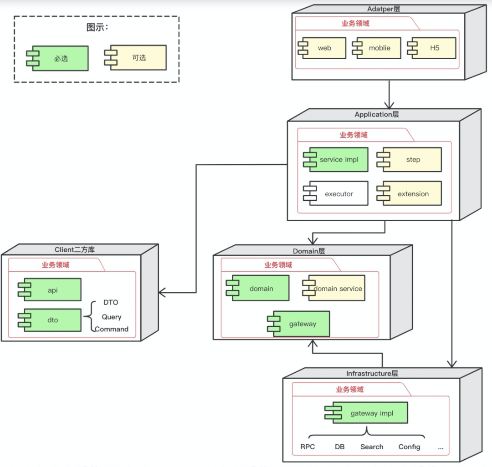

## 1 战略设计

主要的过程大致包括业务场景分析、领域建模、划分边界上下文三个阶段。

### 1.1 业务分析

主要包括：

- 用例分析法

- 事件风暴法

- 四色建模法。

一般使用事件风暴法

事件风暴过程需要问题驱动，一般通过提问的方式来驱动交流。

事件风暴主要完成以下两个目标：

a. 分析业务中的事件，搞清楚事件发生的前因后果

- 即什么动作会导致当前事件的发生，当前事件发生后又会有什么后果
- 注意不但要关注正常的业务流程，也要关注异常的业务流程

b. 寻找业务逻辑和业务规则

- 对业务涉及到的参与者、动作以及事件进行全面的梳理

### 1.2 领域建模

领域建模是整个 DDD 的核心，DDD 领域模型可细分为两步骤：

第一步是发散，产生很多实体（entity, 与 DO 的区别是 entity 是类似充血的的对象，可以定义方法/行为）、命令、事件等领域对象（DomainObject）

第二步是收敛，我们从不同的维度对之发散的产物进行聚类形成聚合，建立最终领域模型， 这是一个收敛的过程。

#### 1.2.1 发散阶段：领域对象分析

领域对象分析，也就是对实体、值对象（Value Object）、领域事件（Domain Events）、领域命令的分析。

#### 1.2.2 收敛阶段：构建业务聚合

完成领域对象分析之后，我们需要构建业务聚合，想要构建聚合，那么首先就要在实体中找到聚合根。

聚合根的主要特点有：

- 聚合根一定是实体，那么它具有全局唯一的标识 （？注：标识是一个类似 ID 的东西，收敛出的业务聚合内的类都继承这个聚合根实体？）

- 聚合根是具备生命周期的（这个后续再看解释）

- 聚合根需要专门的模块来进行管理（？？）

### 1.3 划分边界上下文

得到整个业务流程中的所有聚合之后，我们需要将聚合划分到更具业务语义的上下文中

#### 1.3.1 域的拆分

域是否是 domain？域和上下文的关系是什么？

就是将业务拆分成多个子域，比如电商系统可以包含商品子域、订单子域、用户子域等等。域的翻译是 domain，但此处“域的拆分”中的域是指业务进行上下文拆分之后形成的 domain/子域，**_每个子域都可以作为一个独立的微服务进行设计和开发_**，从而实现更好的业务解耦和系统扩展性。

域和上下文的关系：上下文更像是一个环境、位置的概念，域是上下文中的一块内容。

文档解释：限界上下文是业务的边界的划分，这个边界可以是一个领域或者多个领域的集合。复杂业务需要多个域编排完成一个复杂业务流程。限界上下文可以作为微服务划分的方法。其本质还是高内聚低耦合，只是限界上下文只是站在更高的层面来进行划分。如何进行划分，我的方法是一个界限上下文必须支持一个完整的业务流程，保证这个业务流程所涉及的领域都在一个限界上下文中。

#### 1.3.2 防腐

一个上下文通过一些适配（adapter）和转换与另一个上下文交互。

#### 1.3.3 限界上下文之间的映射关系

## 2 战略设计

经历了战略设计之后，我们构建了领域模型（先发散后收敛，构建聚合），划分了边界上下文，接下来将领域模型映射到工程结构，实现代码的开发落地。在这个阶段还有一些细节需要明确。

### 2.1 领域服务设计

需要哪些领域服务，领域服务依赖哪些属性，依赖哪些实体，依赖哪些值对象，这些都是需要在战术设计阶段明确下来。

### 2.2 领域分层

在领域分层方面，可以按照 cola 分层结构来进行，这个后面结合 cola 框架进行说明。

### 2.3 代码结构

当我们把领域对象进行进一步的细化之后，同时把对应的领域服务敲定之后，我们可以把这些分析后的内容映射成工程分层后的代码了。

## 3 DDD 基本概念

### 3.2 事件

一般采用 发布-订阅 模式。代码层面可以通过事件总线或消息队列间接通信。

### 3.3 实体（Entity）

实体具有唯一标识（例如审批单编号），有生命周期且具有延续性（我理解为审批单不随属性的变化而变化）。实体代码应该包括属性和行为，也就是我们说的充血模型，但是实体在复杂场景下需要编排领域服务，会导致事务过长影响性能。所以使用充血模型的时候，在行为里面只涉及业务逻辑的内存操作，不涉及过长的数据库事务。

### 3.4 值对象（Value Object）

值对象没有唯一标识，没有生命周期，不可修改，当值对象发生改变时只能替换（例如 String 的实现）。

### 3.5 聚合和聚合根

多个实体和值对象组成的集合叫聚合，聚合内部一定高内聚。聚合里面一定有一个实体是聚合根。

作用：保证内部实体的一致性。外部操作聚合内部的实体时，只需要操作聚合根。

聚合与领域可以是一对一的关系，也可以是一对多的关系。

### 3.6 限界上下文，域，聚合，实体，值对象的关系

领域包含限界上下文，限界上下文包含子域，子域包含聚合，聚合包含实体和值对象。

### 3.7 实体和事件的关系

在事件风暴中，我们会分析领域内的业务动作和行为，实体执行命令/做出行为会触发事件。

## 4 DDD 代码实践

### 4.1 DDD 规范

DDD 的代码实践中，规范大于技巧，DDD 架构可以避免引入一些其他概念，系统只有域，域服务，聚合根，实体，值对象，事件来构建系统。

### 4.2 工程结构

#### 4.2.1 application 模块

- CRQS 模式 command 和 query 分离
- 重点做跨域的编排工作，无业务逻辑

#### 4.2.2 domain 模块

- 域服务、聚合根、值对象、领域参数、仓库（repository，与持久化存储（如数据库）交互，一般包括增删改查方法）定义

##### 4.2.2.1 聚合根

以 base-sever 中的 Counterparty 子域为例，交易对手是这个子域中的实体，但是这个子域中只有一个实体，所以没有聚合根。

以下文档中给出的聚合根实践中，实体是聚合根中的一个属性。

[DDD 领域驱动设计内容分享(二)：为什么需要 DDD？\_领域驱动设计 ddd-CSDN 博客](https://blog.csdn.net/qq_45038038/article/details/135132480)

### 4.3 代码示例

#### 4.3.1 domainService 示例

- 领域层不依赖基础层的实现：coordinationRepository 只是接口，在领域层定义好，由基础层依赖领域层实现这个接口。ps：这个已经讲的很清楚了，领域层只定义接口访问基础设施层，接口由基础设施层去实现，将业务逻辑和技术（Mybatis, redis, MQ, ...）解耦。

- 业务逻辑和技术解耦：域服务这层通过调用 coordinationRepository 和聚合根将业务逻辑和技术解耦。

- 聚合根的方法无副作用：聚合根的方法只对聚合根内部实体属性的改变，不做持久化动作，可反复测试。ps：这一点很重要，DDD 中最重要的就是规范，聚合根的方法不做持久化，放到域服务里面做持久化。

- 模型与数据分离：

  - 改变模型：caseAggregate.handle(handleParam.getFollowerValue())。ps：就是只操作内存中的变量。

  - 改变数据：coordinationRepository.save(caseAggregate)；事务是在 save 方法上。ps：就是做持久化。

#### 4.3.2 Aggregate, Entity 示例

**规范大于技巧：** **_DDD 架构可以避免引入一些其他概念，系统只有域，域服务，聚合根，实体，值对象，事件来构建系统。_**

## 5 F&Q

### 5.1

聚合根怎样将聚合内的值对象和实体聚合在一起？DomainService 如何将散落的服务聚合在一起？

柏安的理解：有 ID 的 entity 就算聚合根，这个聚合根要存库，所有聚合根外的操作，都透过这个聚合根处理。

领域内的其余 Entity 都透过这个聚合根访问聚合内部。即 Entity 声明为聚合根的一个 private final 属性，Entity 的方法声明为聚合根的方法，可以抛出聚合根异常。

### 5.2

实体既然是聚合根中的一个属性，那如果只有聚合根存库的话，实体中的属性全部展开？
